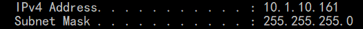

# 1. Introduction on IP Address

## Part 1. IP 地址基础

**每个IP address 都包括两个 ID，一个是 网络ID，一个是主机ID。位于同一个物理网络上的所有主机都使用同一个网络ID**。每个物理网络下面由若干个主机或设备，每个主机或设备都有一个主机ID与之相对应。

IP address 是一个32位的二进制码。为了方便书写和记忆，我们每8位进行一次换算，例如：111....11 （32个1） --&gt; 255.255.255.255 （每个255是10进制，255之间的 点号 没有实际意义）。后来随着网站的增多，人们发现换算后的IP address仍然不方便记忆，例如 10.178.232.1 代表 www.example.com。人们发现还是字符更容易记忆，所以就又有了**DNS**。

**DNS 是将 IP address 变成 字符形式的网址 的工具**。

下面再讲讲网络ID 和 主机ID：

1. 网络ID：**记录的是计算机所位于的网段，网络ID相同的计算机之间的通信  不需要借助路由器（Router）。网络ID相同的计算机所组成的一个网络称为 本地网络 \(Local-Area Network, LAN\)，也叫网段 \(Network Segment\)或局域网**。**网段不相同网络叫做远程网络，想要连接远程网络需要借助路由器（Router）**。通常，公司内部或者家庭内部会设置本地网络，来方便内部计算机之间的通信。IP address根据网络ID的不同，被分成了5类（A类，B类，C类，D类，E类）（_**之后会详细讲述每类是如何划分的**_）。
2. 主机ID：**用来记录当前计算机  在 网段中所处的位置**。

## Part 1. CIDR \(Classless Inter-Domain Routing\)

由于网络ID的分类，造成了IP address的浪费。所以现在普遍使用了CIDR的表示方法，也就是 “**Classless**”，并为此引入了子网掩码（Subnet Mask）的概念，也就是网络位的个数可以任意指定。

**CIDR的表示方法是，IP address/网络ID的位数。例如：20.0.0.0/24**。而网络ID的位数又可以换算成子网掩码。**所以相当于给出了CIDR，就能计算出IP address 和 子网掩码**。例如：在Command Line输入"ipconfig"发现：

**那么我们能根据Subnet Mask和IPv4 Address反算出CIDR：10.1.10.161/24。另外，子网掩码的二进制码中的最后8位是“0”，所以有2^8=256个主机ID**。

**子网掩码：可以将某个IP address 划分成网络地址 和 主机地址 两部分**。子网掩码也是一个32位二进制码，用于屏蔽 IP address 的一部分，并说明该IP address 是在局域网上，还是在远程网络上（方法之后会提到）。**子网掩码不能单独存在，必须结合IP address一起使用。子网掩码的二进制形式中的网络位全为1。这样二进制形式的子网掩码和二进制的IP address进行“与运算”，就可以得到该 IP address 的网络位**。

**允许的子网掩码的值**：

10000000-128；11000000-192；11100000-224；11110000-240；

11111000-248；11111100-252；11111110-254；11111111-255；

**最小IP**：主机ID 不能全为0，（即0.0.0.0）全0表示网络ID

**最大IP**：主机ID 也不能全为1，（即1.1.1.1）全1表示本地广播

**CIDR使用子网掩码中连续的“1”的部分表示网络ID，使用连续的“0”的部分表示主机ID**。例1，**你的一个网络中有2000台计算机，那么你至少需要2^11个主机ID，剩下的21位表示网络ID，那么此时的子网掩码是11111111.11111111.11111000.00000000，变为十进制：255.255.248.0，这时候你的网络中会有2048台计算机，不会造成IP address的浪费**。例2，你的网络中有300台计算机，那么你至少需要2^9个主机ID，剩下的23位表示网络ID，此时子网掩码是11111111.11111111.11111110.00000000，变为十进制：255.255.254.0。

我们知道了已知计算机数量，求IP address的算法。那么已知IP address，如何计算子网的网络ID、子网掩码、起止IP address？



**例1：192.168.23.35/21计算子网的网络ID、子网掩码、起止IP地址**？

子网掩码：**先换成32位：由于“/”后边是“21”，说明子网掩码的前21位是“1”，后11位是“0”：11111111 11111111 11111000 00000000，换成十进制：255.255.248.0**

网络ID：**是“/”前面的部分 与 子网掩码进行 “与运算”得到的。192.168.23.35变成二进制：11000000.10101000.00010111.00100011。和子网掩码11111111.11111111.11111000.00000000进行“与运算”（1 and 1 = 1，其他情况都是 0）：**

**11000000.10101000.00010000.00000000，换算为十进制：192.168.16.0**。

起始IP address：**是网络ID 的最后一位变成 “1”：192.168.16.1**

结束IP address：**是网络ID的的最后一位变成“254”：192.168.16.254**



将163.135.0.0/20 划分为16个子网，计算出第一个和最后一个子网的网络ID、子网掩码、起止IP address？

1. 计算子网掩码：由于“/”后边是20，所以有20个“1”和12个“0”：11111111.11111111.11110000.00000000，变成十进制为：255.255.240.0，即子网掩码。
2. 计算第一个网络ID：**将“/”前的163.135.0.0变成二进制：10100011.10000111.00000000.00000000。然后和11111111.11111111.11110000.00000000进行“与运算”：10100011.10000111.00000000.00000000，转换为十进制：163.135.0.0。由于要划分为16个子网，所以我们将163.135.0.0等分为16份，分别是：163.135.0.0，163.135.16.0，163.135.32.0，......，163.135.240.0（共16个）**
3. **那么第n个网络的起始IP address：163.135.\(n-1\)×16.1。 如，第2个网络的起始IP address为163.135.16.1**
4. **结束IP address：163.135.0.254：163.135.\(n-1\)×16.254。如，第4个网络的结束IP address为163.135.48.254**



192.168.10.14/28，192.168.10.15/28，192.168.10.16/28哪个不是同一网段？


解：判断是不是同一个网段  也就是看它们的网络ID是否相同。相同则是同一个网段。

192.168.10.14/28：网络ID是“/”前和“/”后进行“与运算”得来的：`11000000.10100000.00001010.00001110 & 11111111.11111111.11111111.11110000  
11000000.10100000.00001010.00000000  
十进制表示为：192.168.10.0`

192.168.10.15/28：

`11000000.10100000.00001010.00001111 & 11111111.11111111.11111111.11110000  
11000000.10100000.00001010.00000000  
十进制表示为：192.168.10.0`

192.168.10.16/28：

`11000000.10100000.00001010.00010000 & 11111111.11111111.11111111.11110000  
11000000.10100000.00001010.00010000  
十进制表示为：192.168.10.0`

**`所以这三个CIDR都属于192.168.10.0这个网段。但是要注意`192.168.10.14/28，192.168.10.15/28这两个并不是有效网段。**（原因见例4）



如果你想快速判断CIDR是否合法可以到这里：[https://ipduh.com/ip/cidr/](https://ipduh.com/ip/cidr/)

问：192.168.10.14/28，192.168.10.15/28，192.168.10.16/28，192.168.10.31/28哪些是合法IP，哪些是非法IP地址？

**判断一个CIDR是否合法：**

1. 先看CIDR的“/”后边的数，这里是28，所以说明子网掩码的前28位是"1"，后4位是“0”。
2. 对于子网掩码中最后的n 个 “0”（这里 n 是4位），计算2^n = 2^4 = 16。
3. 然后在“/”前面的 IP address上，最后一位从0开始依次增加16，就是所有合法的CIDR，其余的CIDR都不合法。例如合法的有：192.168.10.0/28，192.168.10.16/28，192.168.10.32/28，192.168.10.48/28……
4. 所以上面的192.168.10.16/28合法。192.168.10.14/28，192.168.10.15/28，192.168.10.31/28不合法

**再看另一个例子**：对于192.168.10.\*/27（\* 是0~255的任意整数），有哪些是合法的？

1. 同样，因为是27，所以子网掩码最后有5个“0”
2. 计算2^5 = 32
3. 所以，从192.168.10.0开始，每增加32，就是一个合法CIDR，其他都不合法。如，合法的有：192.168.10.0，192.168.10.32，192.168.10.64……

**那么同样的“等差增加”的规律适不适用于“/”前面的十进制IP address呢？——不适用。**

**又一个例子：假设你有一个10.0.0.0/22的CIDR，那么10.0.2.0/28这个CIDR合不合法呢？——合法：**

1. 因为是28，所以子网掩码最后有4个“0”
2. 计算2^4 = 16，所以每“等差增加”16，就有一个合法CIDR。
3. 所以10.0.2.0/28是合法的。[https://stackoverflow.com/questions/52232241/how-to-validate-an-invalid-cidr-block](https://stackoverflow.com/questions/52232241/how-to-validate-an-invalid-cidr-block)



\*\*\*\*

